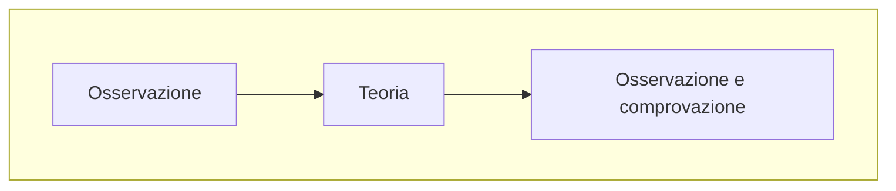

L'economia è una scienza e in quanto tale usa modelli astratti e stilizzati per rappresentare una realtà sul cui poi sopra fare delle *ipotesi*

Per farlo ovviamente è necessario osservare la realtà di cui si vuole fare il modello creare la teoria e osservare come questa si comporta in relazione alla situazione in cui viene applicata

Il punto dello *stilizzare* questa rappresentazione è proprio quello di avere all'interno **solo le cose più rilevanti** al suo funzionamento e quindi non trascurabili
Tutto questo è molto utile perché permette poi di trasformare il modello stilizzato in *formule matematiche* che useremo poi per "***predire***" dei comportamenti o delle cose che succedono nella realtà

Questo deve fare capire che lo scopo dell'economista è quello di essere in grado di pensare e dare ipotesi corrette e adeguate
Queste ipotesi dipendono completamente dal problema che si sta affrontando e i vari criteri che si devono seguire

### Ma come si crea un modello?

Il modello deve contenere all'interno varie cose:
- Variabili
	- Esogene (interne al sistema)
	- Endogene (esterne al sistema)
- Valori della soluzione
- Parametri
- Equazioni

#### Equazioni
Ci sono vari tipi di equazioni:
- Di definizione:
  Un esempio è proprio l'equazione del profitto che banalissimamente  è:
  $\pi=R-C$ di cui $\pi$ è il profitto $R$ sono i ricavi e $C$ sono i costi
  Ovviamente il profitto che si ottiene è proprio il ricavo meno i costi che ho sostenuto per creare il prodotto
- 