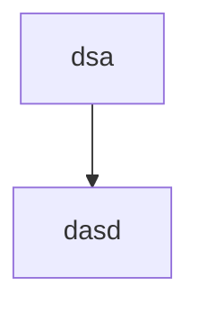

L'economia è una scienza e in quanto tale usa modelli astratti e stilizzati per rappresentare una realtà sul cui poi sopra fare delle *ipotesi*

Per farlo ovviamente è necessario osservare la realtà di cui si vuole fare il modello creare la teoria e osservare come questa si comporta in relazione alla situazione in cui viene applicata

