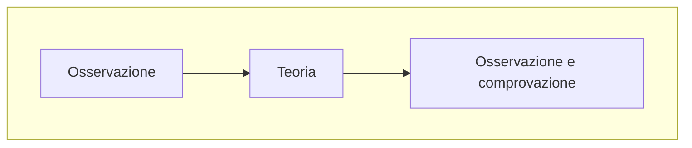

# Modello economico
L'economia è una scienza e in quanto tale usa modelli astratti e stilizzati per rappresentare una realtà sul cui poi sopra fare delle *ipotesi*

Per farlo ovviamente è necessario osservare la realtà di cui si vuole fare il modello creare la teoria e osservare come questa si comporta in relazione alla situazione in cui viene applicata

Il punto dello *stilizzare* questa rappresentazione è proprio quello di avere all'interno **solo le cose più rilevanti** al suo funzionamento e quindi non trascurabili
Tutto questo è molto utile perché permette poi di trasformare il modello stilizzato in *formule matematiche* che useremo poi per "***predire***" dei comportamenti o delle cose che succedono nella realtà

Questo deve fare capire che lo scopo dell'economista è quello di essere in grado di pensare e dare ipotesi corrette e adeguate
Queste ipotesi dipendono completamente dal problema che si sta affrontando e i vari criteri che si devono seguire

### Ma come si crea un modello?

Il modello deve contenere all'interno varie cose:
- Variabili
	- Esogene (interne al sistema)
	- Endogene (esterne al sistema)
- Valori della soluzione
- Parametri
- Equazioni

#### Equazioni
Ci sono vari tipi di equazioni:
- Di definizione:
  - Un esempio è proprio l'equazione del profitto che banalissimamente  è:
  $\pi=R-C$ di cui $\pi$ è il profitto $R$ sono i ricavi e $C$ sono i costi
  Ovviamente il profitto che si ottiene è proprio il ricavo meno i costi che ho sostenuto per creare il prodotto
- Di comportamento:
  - $I=f(\pi)$ dove $I$ è l'investimento che è ovviamente uguale a una funzione che ha come variabile il profitto che ottengo da esso
  - $Q=f(L,K)$ in cui $Q$  è la quantità prodotta che sarà il risultato di una funzione che prende come argomenti il lavoro $L$ e il capitale $K$ ovvero i due **fattori di produzione**
- Condizioni di equilibrio:
	- $Q_d=Q_o$ di cui $Q_d$ è la quantità di *[[Mercato#La domanda e l'offerta|domanda]]* e $Q_o$ è la quantità di offerta

#### perché un prodotto ha un certo prezzo?
Questa é una domanda che ci si può fare che ci permette di mettere in funzione le equazioni elencate prima

Il prezzo è infatti dato dalla **condizione di equilibrio** data dalla quantità di prodotti domandata $Q_d$ a un certo prezzo e la quantità offerta $Q_o$ a un certo prezzo

Ma quali sono le equazioni di questi due valori?

Questo si ottiene attraverso un'analisi che non ci è ancora stata spiegata ma facciamo finta che in un ipotetico mercato le equazioni della domanda e dell'offerta siano:
- Domanda:
	- $P=2+3Q_o$
- Offerta:
	- $P=10-Q_d$

Si cerca quindi la condizione di equilibrio che indica che $Q_o=Q_d$ in quanto il produttore vuole produrre abbastanza da vendere tutto ciò che ha prodotto senza lasciare nessuno insoddisfatto
> [!attention] attenzione
> Il professore ha nominato come esempio anche la Ferrari che produce poco ma comunque soddisfa questo requisito in quanto una persona che non se la può permettere non ha nemmeno in programma di comprarla e quindi non rimarrà insoddisfatta.
> Questo per specificare che il "rimanere insoddisfatto" implica il volere comprare ma non poterlo fare per mancanza

## Costo-opportunità
Il costo opportunità sono i soldi *implicitamente* persi perché si ha deciso di non sfruttare un'opportunità

# Il benefici e costi marginali
Prendendo un azione $X$
Noi aumenteremo l'azione solo se la disponibilità massima a pagare qualcosa è maggiore del costo
$B(X)>C(X)$

## Prezzi di riserva
Ci sono due tipi di prezzi di riserva:
- Prezzo di riserva del beneficio:
	- Il prezzo che si è disposti a pagare per un servizio o oggetto (*diverso da quello che paghiamo effettivamente.* Il prof fa l'esempio delle chiamate che anche se per noi una chiamata vale 100 euro non chiameremo il provider per farmi pagare quella chiamata 100 euro)
- Prezzo di riserva del costo:
	- La quantità minima che sono disposto a ricevere per poter sostenere un costo

## Costi e benefici marginali
I costi e benefici marginali sono i costi e benefici di tipo incrementali rispetto a piccole variazioni

Infatti quando si vuole fare una variazione il costo marginale dirà quanto aumenterà il costo da sostenere una volta applicata e il beneficio marginale dirà quanto aumenterà il guadagno da quella variazione

Per questo per fare una decisione bisogna guardare sempre il beneficio marginale e agire di conseguenza:
Avendo dei cambiamenti $X_i$
$B_mg(X_i)>Cmg(X_i) \Longrightarrow$ Espandere la propria azione
$B_mg(X_i)<Cmg(X_i) \Longrightarrow$ Ridurre l'azione
$B_mg(X_i)=Cmg(X_i) \Longrightarrow$ Rimanere così come si è

In ogni caso quando si parla di beneficio o costo marginale si fa la derivata prima.
Quindi nel caso in cui $B_mg(X_i)=Cmg(X_i)$

$B_n(X)= B(X)-C(X)$
E la derivata prima sarà $0$
$B_n'(X)=0$
$B'(X)-C'(X)=0$

