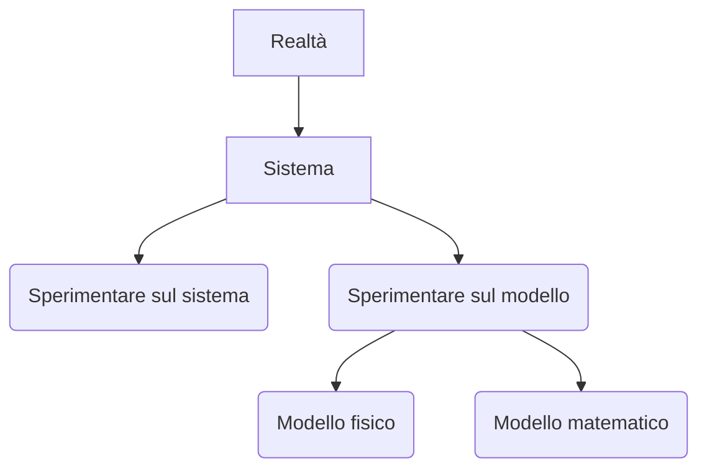

## Cos'è l'economia
Innanzitutto si da per scontato che le risorse siano limitate anzi ancora peggio scarse e di conseguenza tutti sono costretti a fare delle scelte (queste scelte sono in generale chiedersi se si può fare qualcosa senza dover rinunciare ad altro)

Il fatto che le risorse siano scarse viene dato praticamente come definizione perché i bisogni sono illimitati.
> [!example]- esempio
> Per esempio mentre una persona con meno soldi ha problemi nel comprare qualcosa con costo minore
> Qualcuno come Elon Musk avrà gli stessi problemi ma il target dei suoi problemi andrà su cose con costo maggiore (comprare imprese, ecc...)

L'avere risorse scarse e bisogni illimitati genera quindi la necessità di produrre con meno risorse possibili

## Che fattori di produzione ci sono?
- **Risorse naturali**: 
  petrolio, acqua, ecc...
- **Lavoro**: 
  impegno fisico e mentale che una persona spende per produrre beni e servizi
- **Capitale fisico**: 
  cose come macchinari o edifici usati per produrre beni o servizi
- **Capitale umano**: 
  quello che una persona è in grado di fare. Viene aumentato da: istruzione, esperienza e abilità
- **Imprenditorialità**: 
  Dover fare delle scelte per aumentare il proprio capitale

## Che domande mi devo fare quando devo produrre beni o servizi?
Ma una volta capito tutto questo ci sono tre domande:
1. ***Cosa produrre?***
   **Quali** o **quanti** beni o servizi produrre
2. ***Come produrlo?***
   Quali risorse devono essere impiegate per la produzione
3. ***Chi consuma il prodotto?***
   Come e dove dover distribuire la produzione

## Che tipologie di analisi ci sono in economia?
Poi dobbiamo sapere che tipologia di analisi dobbiamo fare per poter fare delle decisioni
Ci sono due tipi di analisi che possiamo fare:
- **Analisi positiva** (quella su cui ci concentreremo noi):
	  Non interessa sapere se una cosa è giusta l'interesse è solo sapere se produce
	  Serve più per capire quali sono i nessi tra azione e produzione
- **Analisi normativa**:
	  Con questa analisi ho un obbiettivo e trovo un modo economico per raggiungerlo  
> [!example] esempio
> Voglio fare fumare meno le persone quindi alzo le tasse sulle sigarette

#### Questioni positive
Ovviamente per fare un'analisi positiva è necessario farsi delle domande del tipo:
- Se il governo aumenta il salario minimo che succede?
- Quando due fornitori si fondono il prezzo cambia
- Qual'è l'influenza che l'istruzione universitaria da sull'individuo?
- Come reagiscono i consumatori a una riduzione dell'imposta sul reddito?

## Modello economico
Un modello economico è una rappresentazione stilizzata di una determinata situazione economica:


Questo cambia dipendentemente dal posto e il tempo della situazione rappresentata dal modello
Poi verrà espresso in forma di formule matematiche

## Ma come deve pensare un economista?
- Fare ipotesi semplificatrici:
	- Riconoscere il limite del modello che si sta utilizzando in un certo momento
	- Dipendentemente dalla situazione in cui mi trovo il modello e il target dell'attenzione cambia
- Approccio ceteris paribus (parità di altre condizioni):
	- Cercare di se un cambiamento permette di guadagnare o meno mettendo conto anche le altre condizioni (*Se faccio un cambiamento che dovrebbe farmi guadagnare. Ma scoppia la terza guerra mondiale...*)
- Ragionamento al margine:
	- Cercare di ragionare quando conviene fare qualcosa e per quanto tempo conviene farlo per mantenere il guadagno al meglio possibile 
- Ipotesi che gli individui reagiscono agli incentivi:
	- Si da ovviamente per scontato che le persone reagiscano agli incentivi come sconti ecc..

## Microeconomia e Macroeconomia
- Microeconomia: L'economia che si trova all'interno di cose come:
	- Nuclei famigliari, imprese, ecc..
- Macroeconomia: L'economia che si trova all'interno di intere nazioni *in senso lato* ad esempio nazioni all'interno dell'unione europea o l'unione europea stessa


## Molta presenza di grafici
Praticamente tutto in economia viene infine rappresentato attraverso grafici.
```mermaid
---
config:
	themeVariables:
		xyChart:
			lineColor: "#ff0000"
---
xychart-beta
    title "Sales Revenue"
    x-axis [jan, feb, mar, apr, may, jun, jul, aug, sep, oct, nov, dec]
    y-axis "Revenue (in $)" 4000 --> 11000
    line [5000, 6000, 7500, 8200, 9500, 10500, 11000, 10200, 9200, 8500, 7000, 6000]
```